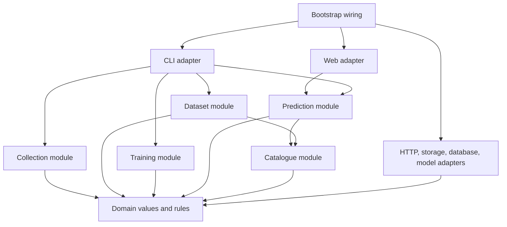
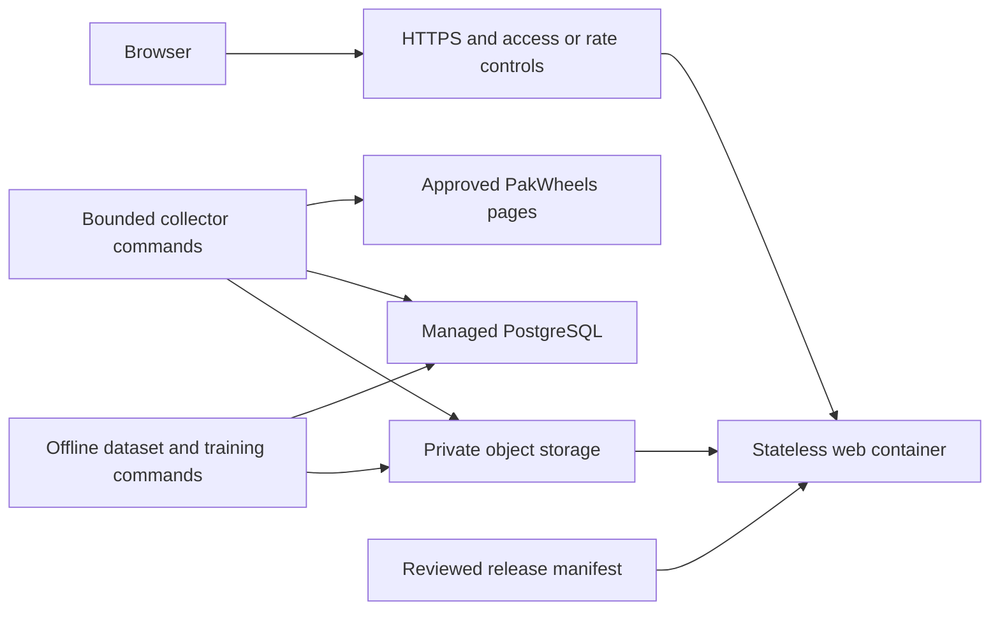

# Pakistan vehicle price predictor: implementation and production plan

Prepared on 1 October 2026. This is a proposed implementation plan, not a report of completed development. It builds on [the project handbook](PakWheels_Vehicle_Price_Predictor_Handbook.md), the existing scraper, and the current CSV sample.

**Execution order updated:** Start with [the data and modeling pilot](DATA_MODELING_PILOT_PLAN.md). Reuse the working scraper, verify data and features, compare algorithms, build a local demo, and evaluate larger training datasets before beginning this document's production work. The framework and infrastructure choices below are future recommendations to reassess after the pilot, not immediate implementation commitments. The pilot's milestones take precedence over this document's early phase and PR sequence.

For the main decisions, read [recommended direction](#1-recommended-direction), [framework assessment](#4-framework-assessment-and-decision), and [module design](#5-module-design-and-dependency-rules). For execution, use [implementation phases](#21-implementation-phases-and-completion-gates) and [suggested pull requests](#22-suggested-first-pull-requests). The intervening sections define the contracts and release evidence those phases need.

## 1. Recommended direction

Build one modular Python application with FastAPI, a responsive interface rendered with Jinja templates, and a small amount of JavaScript. Train separate car and motorcycle models. Run collection, dataset preparation, and training through explicit commands outside the web request process.

Use PostgreSQL for durable collection state once the collector is refactored, private object storage for datasets and model bundles, and Linux Docker images for deployment. Start with a single web process. Add infrastructure when measured traffic or operational requirements justify it.

The first useful release should predict asking prices for a deliberately limited, validated vehicle catalogue. It should have the same input contracts, artifact format, and release process that later production versions will use. Expand coverage by publishing new reviewed catalogues and model bundles.

The most expensive mistake would be making training and inference interpret a vehicle differently. Shared identity normalization, versioned feature definitions, and immutable model bundles are the first architectural priorities.

### Decisions to adopt

| Area | Initial decision | Reason |
|---|---|---|
| Application architecture | Modular monolith in one Python package | Keeps development and deployment manageable while concentrating each concern in a module |
| Web framework | FastAPI | Explicit request contracts, validation, OpenAPI, and a suitable model startup lifecycle |
| Interface | Jinja templates, CSS, small JavaScript modules | One deployment, no separate frontend build system, enough interaction for dependent dropdowns |
| Database | PostgreSQL, SQLAlchemy, Alembic | Durable jobs, observations, review decisions, and migrations across local and deployed environments |
| Dataset files | CSV for exchange; Parquet for versioned training datasets | Retains compatibility with current outputs while preserving typed training data |
| Model selection | Training-only median baseline, Random Forest, CatBoost comparison | Measures whether model complexity actually improves estimates |
| Model serving | Approved bundles loaded into memory at startup | Predictable latency and no per-request artifact downloads |
| Collection | One sequential collector per source | Matches current access assumptions and avoids multiplying request volume |
| Background execution | CLI commands, then bounded scheduled jobs | Resumable work without a queue platform initially |
| Deployment | Docker on Render for the first hosted version, managed PostgreSQL, private S3 storage | A concrete managed path with a portable application image |
| Quality tooling | pytest, Ruff, mypy, uv lockfile | Reproducible environments and checks concentrated on actual failure modes |
| Promotion | Explicit dataset, model, and application release gates | Prevents an unreviewed model or catalogue change from becoming live |

These choices are project judgments. Official documentation supports the framework behavior; it does not establish that any framework guarantees better predictions or production reliability. See [the framework research](docs/framework-research.md).

## 2. Starting point and constraints

The working folder currently contains `scraper.py`, `requirements.txt`, `README.md`, the handbook, and both CSV outputs. There is no initialized Git repository in this folder.

The inspected clean CSV has ten records, all marked parser complete. It includes electric cars, imported vehicles, multiple cities, and titles with substantial variant information. This is enough to exercise a collection and import pipeline. It is insufficient to select a trustworthy predictive model.

The current collector has useful behavior worth preserving: sequential requests, Pakistani price conversion, ordered URL discovery, incomplete-row retention, diagnostic output, and incremental saves. Its important limitations are title-based identity, broad text matching, one row per URL, repeated CSV rewrites, no durable retry queue, and limited detection of successful HTTP responses containing challenge pages.

Authorization to collect and build the application is already reported in the handbook. The requested private review must happen before public publication. A hosted review environment therefore needs access control from its first deployment.

### Working assumptions

- One developer or a small team will maintain the project.
- Windows remains the development environment; Linux is the deployment environment.
- The first interface supports individual predictions, not bulk uploads.
- User accounts, payments, dealer management, and a public staff dashboard are outside the first release.
- Customers supply vehicle attributes. The application does not fetch arbitrary URLs submitted by customers.
- Traffic and hosting budget are unknown. Start with modest resources and a documented load test, then select the actual paid hosting sizes.
- Asking price is the target. Verified sale prices, physical condition inspection, and market-wide valuation claims are unavailable.

Revisit a decision when one of these assumptions changes. Budget and traffic uncertainty should affect instance sizing, not delay the module design or data audit.

## 3. Product scope and release sequence

### First end-to-end increment

Complete one car prediction path from an imported, reviewed dataset to a local form and a versioned result. A deliberately tiny model may be used only to verify integration, labelled as a development artifact. Its predictions must never enter a public release.

Expose only car families with sufficient reviewed evidence. Start catalogue work with Suzuki, Toyota, Honda, KIA, and Hyundai. The observed dataset also contains other makes; preserve those raw records and classify their first-release support separately. Do not assume the proposed makes already have adequate data.

After this path is working, add the motorcycle adapter and model through the same established contracts. A motorcycle selector appears only when an approved motorcycle bundle exists.

### First motorcycle scope

Preserve the user's collection priority:

1. Honda CD 70.
2. Honda CG 125.
3. Honda CB 150F.
4. Suzuki GS 150.
5. Suzuki GR 150.
6. Yamaha YBR 125.

Retain Dream, SE, G, self-start, and other variant identities for review. Family membership does not establish that every variant is supported.

### First public production release

Users can select a supported car or motorcycle, enter validated attributes, and obtain an estimated asking price in PKR. Results show the model version, the data observation period, and applicable limitations. Unsupported combinations receive an understandable response. A price interval appears only after calibration and test coverage have passed review.

The application is production ready within this supported scope when the release gates in Section 21 pass. Broader vehicle coverage is a later dataset and model improvement, not a prerequisite for reliable operation of the initial release.

## 4. Framework assessment and decision

### Comparison for this application

| Criterion | Flask | FastAPI | Django |
|---|---|---|---|
| Typed prediction inputs | Usually requires additional validation integration | Pydantic request and response models fit directly | Forms and model validation fit conventional applications; typed JSON APIs require a deliberate additional approach |
| Documented JSON interface | Requires explicit OpenAPI integration | OpenAPI generation is built into its request model approach | Usually add an API toolkit or maintain a separate contract |
| Template interface | Excellent fit with Jinja | Supported through its template integration | Strong built-in template system |
| Staff catalogue editing and accounts | Assemble extensions or build workflows | Assemble libraries or build workflows | Built-in admin and authentication are a strong advantage |
| ML inference integration | Straightforward | Straightforward with explicit startup and request contracts | Straightforward but comes with a broader application framework |
| Operational production path | WSGI production server and managed hosting | ASGI server and managed hosting | WSGI or ASGI production server and managed hosting |
| Main tradeoff here | More choices to standardize validation and API documentation | Requires restraint around async code and custom staff tooling | More framework structure than the initial prediction workflow needs |

Flask is production capable. Its official documentation requires a production server for deployed applications. FastAPI's documented validation and OpenAPI behavior reduces the custom plumbing needed for two independent prediction schemas. Django's admin is valuable if operational editing becomes a major workflow. [Flask deployment](https://flask.palletsprojects.com/en/stable/deploying/), [FastAPI features](https://fastapi.tiangolo.com/features/), [Django overview](https://docs.djangoproject.com/en/5.2/intro/overview/).

### Select FastAPI

The central web workflow is a validated prediction request with versioned inputs and outputs. There is no current requirement for a large account system, dealer portal, or interactive staff administration. FastAPI fits that workflow while keeping the web adapter small.

The choice does not depend on claims about framework speed. CatBoost prediction is synchronous work. Plain `def` handlers are dispatched through a thread pool; directly calling a blocking function inside `async def` does not make that call asynchronous. Start with synchronous prediction handlers and measure their actual latency. [FastAPI concurrency guidance](https://fastapi.tiangolo.com/async/).

Use FastAPI routers for transport organization, and lifespan for approved bundle loading. Framework imports stay in the web adapter and composition code. Domain rules and prediction orchestration can then be exercised through the CLI and tests. [FastAPI multiple-file applications](https://fastapi.tiangolo.com/tutorial/bigger-applications/), [FastAPI lifespan](https://fastapi.tiangolo.com/advanced/events/).

### When to revisit the choice

If staff need daily browser-based catalogue review, permissions, audit trails, and extensive CRUD screens before model development, compare Django again before building those screens. Do not introduce a second framework merely to obtain an admin page. For occasional review, CSV or JSON review queues and a CLI are sufficient.

Streamlit can help with internal model exploration, but the customer application needs explicit contracts, controlled failures, and a stable release process. A separate React or Next.js frontend becomes worth assessing if interaction grows into saved comparisons, dealer workflows, or a dedicated frontend team. The first release can deliver a polished responsive form without that additional deployment.

## 5. Module design and dependency rules

Use modules with small interfaces that hide parsing details, storage behavior, preprocessing, and model loading. A module earns its place when it concentrates knowledge that otherwise spreads across callers.

### Primary modules

| Module | Interface and responsibility | Details hidden inside |
|---|---|---|
| `domain` | Vehicle identity, observations, quality decisions, prediction outcomes | Invariants and stable vocabulary |
| `catalogue` | Resolve an identity and list reviewed entries for a catalogue version | Aliases, longest model matches, ambiguity rules, variant policy |
| `collection` | Execute or resume a bounded collection plan | Discovery, delays, leases, failures, checkpoints, parser dispatch |
| `datasets` | Audit imports and build an immutable dataset from a manifest | Quality filtering, grouping, snapshot selection, exclusions, split membership |
| `training` | Train and evaluate a candidate from a dataset ID and configuration | Fitted transformations, model comparison, calibration, bundle construction |
| `prediction` | Evaluate a prediction command against a loaded approved bundle | Support checks, feature construction, model invocation, output validation |
| `adapters` | Fetch pages, store artifacts, persist collection state, invoke a model | HTTP, PostgreSQL, filesystem, S3, CatBoost, sklearn |
| `web` | Map HTTP requests and responses to module interfaces | FastAPI DTOs, status codes, templates, headers, request IDs |
| `cli` | Map command arguments to the same module interfaces | Command parsing, exit codes, operator summaries |
| `bootstrap` | Construct configured adapters and pass dependencies explicitly | Settings and process-specific wiring |

### Dependency direction



Bootstrap injects adapters into the consuming modules. The diagram shows code dependencies rather than a runtime network diagram.

Rules:

1. `domain` uses the standard library. It does not import FastAPI, pandas, SQLAlchemy, requests, or CatBoost.
2. HTTP DTOs use Pydantic and convert to domain values. ORM mappings remain in database adapters. A pandas DataFrame remains inside dataset or model implementations.
3. Shared normalization and feature construction have one implementation used by training and inference.
4. The CLI and web adapters do not repeat support rules or feature defaults.
5. The web process never imports the collector or starts training.
6. Importing a module does not open database connections, download files, or load a model. Bootstrap and lifespan perform those actions explicitly.
7. A public module interface documents null handling, errors, configuration requirements, and important execution costs.

Do not create an interface for every function. Parser dispatch already has real variation between cars and bikes. Artifact storage has filesystem and S3 implementations. Predictor invocation varies between the baseline, Random Forest, and CatBoost. These are useful seams. A speculative generic repository or universal plugin framework adds little value.

## 6. SOLID and clean code in practical terms

| Principle | Concrete application | Review question |
|---|---|---|
| Single responsibility | Parser extracts source attributes; quality policy decides eligibility; predictor estimates price | Does changing an extraction selector require editing a route or trainer? |
| Open/closed | Register a car or bike parser behind the collector interface; choose a predictor adapter by bundle metadata | Can a verified bike adapter be added without copying the entire collector? |
| Liskov substitution | All predictor adapters consume the declared feature contract and return finite PKR outcomes with the same error behavior | Does an adapter silently interpret missing values or target transforms differently? |
| Interface segregation | Prediction needs an already-loaded bundle; it does not receive the full storage or training module interface | Does a caller depend on operations it never uses? |
| Dependency inversion | Collection accepts a fetcher, state adapter, clock, and parser; prediction accepts a loaded bundle | Can behavior be exercised without a real website or production artifact bucket? |

Use typed dataclasses for stable domain values and ordinary functions for deterministic transformations. Introduce classes when they hold meaningful state, manage a resource lifecycle, or implement a genuine adapter. Prefer composition over parser or model inheritance hierarchies.

Choose descriptive names such as `build_dataset`, `normalize_identity`, and `estimate_price`. Avoid a broad `utils.py` or catch-all `services.py`. Keep configuration explicit. Raise named errors such as `AccessRestricted`, `InvalidVehicle`, `UnsupportedVehicle`, and `BundleIncompatible`.

The application may branch on car versus bike at routing and parser selection. Vehicle-specific rules belong with their own schema and policy; scattered `if vehicle_type == ...` branches through persistence, routes, and training are a sign that knowledge has leaked between modules.

The domain interface should be easy to understand without learning the web framework. The infrastructure implementation should be replaceable without translating every domain rule into a different format.

## 7. Repository layout and environment

Grow into this layout as work reaches each module. Creating every placeholder on day one provides no working behavior.

```text
pakwheels-price-predictor/
  scraper.py                         # Preserved baseline during migration
  README.md
  PRODUCTION_IMPLEMENTATION_PLAN.md
  PakWheels_Vehicle_Price_Predictor_Handbook.md
  pyproject.toml
  uv.lock
  .python-version
  .env.example
  .gitignore
  .dockerignore
  Dockerfile
  compose.yaml                       # Local PostgreSQL and app when needed
  alembic.ini
  migrations/
  src/vehicle_price/
    domain/
      vehicles.py
      observations.py
      predictions.py
      errors.py
    catalogue/
      resolver.py
      policy.py
    collection/
      runner.py
      plans.py
      parsers/
        cars.py
        bikes.py
    datasets/
      audit.py
      build.py
      grouping.py
      features.py                    # Shared training/inference transforms
    training/
      run.py
      evaluate.py
      calibration.py                # Introduced when intervals are built
      bundles.py
    prediction/
      estimate.py
      support.py
    adapters/
      pakwheels_http.py
      postgres/
        mappings.py
        collection_state.py
      artifacts.py                  # Filesystem, then S3 implementation
      predictors.py                 # Supported model implementations
    web/
      app.py
      schemas.py
      routes/
        predictions.py
        catalogue.py
        health.py
      templates/
      static/
    cli.py
    settings.py
    bootstrap.py
  catalogues/
    cars.json
    bikes.json
    cities.json
  configs/
    collection/
    experiments/
  tests/
    unit/
    integration/
    contract/
    fixtures/                        # Redacted permitted HTML and tiny data
  reports/                           # Shareable reports, without seller data
  docs/
    framework-research.md
    decisions/
    runbooks/
  .github/workflows/
  data/                              # Private local files, excluded from Git
  artifacts/                         # Private local bundles, excluded from Git
```

`datasets/features.py` must import cleanly without requiring a training command to run. It may depend on the pinned catalogue supplied by the bundle, but never on a mutable live catalogue lookup. If it later becomes too broad, move shared feature rules into a dedicated `features` module without changing their interface.

Start by recording the current interpreter and installed packages. Use Python 3.12 as the initial compatibility target only after the actual dependencies and Linux wheels are validated. Capture the working environment before migrating to `pyproject.toml` and `uv.lock`; do not casually synchronize away packages in the current `.venv`.

Define a small base package, optional dependency sets for `collect`, `train`, and `web`, and a development group. Collection libraries should not be needed by the serving image. CatBoost and any selected preprocessing libraries do belong in serving when the bundle requires them. CI validates Windows and Linux compatibility for changed modules, while Linux is the required deployment target.

Use `uv sync --locked` for validated builds. An outdated lockfile should fail the build rather than silently resolve new versions. Retain `requirements.txt` during migration, then either generate it from the lockfile or clearly mark it as the legacy collector environment. [uv locking and synchronization](https://docs.astral.sh/uv/concepts/projects/sync/).

## 8. Data contracts and catalogue rules

### Separate three states

| State | Meaning | Where used |
|---|---|---|
| Parser complete | Source extraction has the minimum required fields for that parser | Collection diagnostics |
| Training eligible | Reviewed identity, acceptable values, required model inputs, and reproducible quality decisions | Dataset construction |
| Prediction supported | Approved bundle has evidence for this identity and input range | Customer interface and inference |

A parser-complete BMW electric car can be valid raw data while remaining outside the first supported car catalogue. Missing engine displacement is legitimate for an electric vehicle. Do not manufacture `engine_cc=0` or label its non-applicability as a parser failure.

### Core values

Use integer PKR for advertised prices and presentation results, integer kilometres for recorded mileage, validated model year, UTC timestamps, and canonical IDs for make, model, variant, and city. Preserve source values alongside normalized ones. Keep non-applicable, unspecified, and extraction-failed values distinguishable in provenance.

Do not use city strings or display names as durable foreign keys. A spelling or capitalization correction should not invalidate old bundles.

Catalogue entries include a stable ID, display name, aliases, family relationship, review status, and version. Vehicle variants may include reviewed engine or transmission facts. Catalogue-derived values require explicit provenance and should not overwrite source evidence.

Resolver outcomes are `matched`, `matched_variant_review`, `unmatched`, or `ambiguous`, with a reason. It must preserve unconsumed title text and avoid guessing from the first two words. Prefer verified structured identity fields, then use conservative title matching. A conflict between the two becomes a quality flag.

Unspecified variant is a valid explicit category only if the dataset contains that category and its support has been evaluated. It is not an automatic alias for the standard trim.

### First feature contracts

Cars begin with make, model, reviewed variant where available, model year, mileage, and listing city. Add fuel, transmission, and engine displacement only when audit results show reliable coverage and customers can supply them. Registration, assembly, and body type remain candidates subject to the same test.

Motorcycles begin with make, model, reviewed variant, model year, mileage, and listing city. Add registration or engine attributes only after representative extraction and input availability are verified. Transmission may add little information within the initial families and should earn its inclusion through evaluation.

The exact first training schema is frozen after the audit. Prefer a smaller reliable input set over a form filled with weak or unavailable attributes. Every fitted imputer, category convention, target transform, and derived feature belongs to the bundle contract.

## 9. Persistence, snapshots, and reproducibility

Use PostgreSQL from the first durable queue implementation, locally through Docker and hosted through a managed instance. The ten-row audit can run directly on CSV before that migration. This avoids building and maintaining a SQLite-to-PostgreSQL transition for the collector.

The web predictor can operate from its bundle without a database query. PostgreSQL is necessary for collection and optional later workflows, not a dependency of every price request.

### Logical records

| Record | Key facts | Important invariant |
|---|---|---|
| `listing` | Source, vehicle type, source listing ID, canonical URL, first/last seen | Unique source/type/listing ID |
| `observation` | Listing ID, fetch time, source response checksum, snapshot location | A new collection observation never overwrites price history |
| `parse_result` | Observation ID, parser version, extracted fields, field provenance, errors | Reprocessing creates a new versioned result |
| `collection_run` | Plan version, approved filters, limits, counters, start/end, stop reason | A run reports actual requests and outcomes |
| `collection_task` | Run, URL, attempt state, retry time, lease, error | Checkpoint and retry state survive process restart |
| `review_decision` | Subject, quality decision, reason, reviewer, catalogue/policy version | An override is explainable and traceable |
| Dataset manifest | Input observation IDs, selection rules, versions, hashes, split assignments | Same manifest reproduces the same training population |
| Bundle manifest | Dataset ID, code commit, schema, model, metrics, support rules, checksums | A published bundle is immutable |

Dataset and bundle manifests can live as JSON in object storage initially. Add a searchable registry table when operators actually need it. Store HTML and large dataset files outside PostgreSQL; persist their locations and hashes in records.

Import the current CSV as legacy observations, with original collection timestamps and an explicit parser provenance marker. The absence of original HTML is recorded. The import must be idempotent and must not pretend that all fields have verified extraction provenance.

For training, select one observation per vehicle group for the main single-period dataset. Preserve all observations in storage. A later history experiment can use additional snapshots, but must document weighting and grouping so frequent collection of one advertisement does not dominate training.

Transactions commit an observation, parse result, and task completion coherently. Upload artifacts before recording a durable artifact reference, and reconcile orphan uploads after interrupted transactions. Use one SQLAlchemy session per operation; never share a session across concurrent request threads. [SQLAlchemy session guidance](https://docs.sqlalchemy.org/en/20/orm/session_basics.html).

Schema changes use reviewed Alembic migrations, tested against PostgreSQL. Do not create or alter database tables automatically at web startup. [Alembic tutorial](https://alembic.sqlalchemy.org/en/latest/tutorial.html).

## 10. Collector refactor and execution policy

Preserve `scraper.py` while moving verified behavior into the package. Build regression fixtures first, then compare parsing and exports through the new module interface. The baseline remains executable until the replacement handles its demonstrated cases.

### Collection command contract

The proposed `vehicle-price collect` command takes a versioned plan, a maximum number of detail attempts, and a maximum elapsed duration. A plan records vehicle type, reviewed search URLs, intended strata, start page, request delay, contact identity, and output policy.

Implement separate counters for discovered URLs, duplicate URLs, queued tasks, detail attempts, network failures, parser-complete results, training-eligible results, and new listings. Clearly define `--max-detail-attempts`; saved URLs should not consume a new-listing target silently.

### Request and failure rules

- One active collector per source across both cars and bikes. Start with a database-backed source lease; later scheduling must respect the same lease.
- Renew that lease with a heartbeat and use an ownership token for task commits. Stop outbound requests if ownership is lost. Keep network waits and delays outside long database transactions; a sleeping collector must not hold row locks for its entire run.
- Sleep between all outbound requests, including search requests and transient retries. Preserve the current five-second default until agreed collection conditions change.
- Set connect/read timeouts and an identifiable user agent. Restrict discovery and redirects to reviewed source hosts and paths. A redirect to an unexpected host is an error.
- HTTP 401, 403, 429, or verified challenge markup stops the source run. Record the stop condition durably. Do not automatically retry around it.
- Retry ordinary timeouts and temporary 5xx errors at most three total attempts per task, with increasing delay and jitter. Persist attempts and next retry time.
- Treat removed listings such as 404 or 410 as terminal task outcomes. Never silently delete their older observations.
- Detect HTTP-200 challenge pages through verified markup and structure, not the mere presence of words such as 'captcha' in arbitrary text.
- Resume leased tasks after a lease expires. A database uniqueness constraint prevents duplicate logical outcomes after a crash.
- Checkpoint pagination and queue discovery as well as detail results. A restart must not rediscover the entire marketplace to find its next task.

Collection admission and request pacing are independent from web request rate limits. Additional web replicas must never create additional source collectors.

### Parsing strategy

Use verified main-detail selectors or trusted structured fields, then narrowly scoped fallbacks. Record the original price text, extraction method, and relevant selector or field. Price, year, and mileage should not be drawn from recommended advertisements or seller biographies.

Representative fixtures must cover lac/crore/full-PKR prices, zero mileage, missing mileage, optional engine fields, electric cars, variants, unrelated recommendation prices, changed markup, and challenge responses. For motorcycles, capture permitted examples from all six families before finalizing URL patterns or selectors.

Keep collection sequential. Large runs are resumable batches. At a five-second delay, 30,000 detail requests alone require at least 41.7 hours, before searches, network time, retries, and pauses. Collection effort can dominate the schedule even when coding is fast.

## 11. Dataset audit and collection priorities

### First audit of the existing sample

1. Preserve both CSVs with checksums in private storage.
2. Confirm types, unique IDs, timestamp parsing, duplicates, missingness, and price-unit conversion.
3. Review all ten rows against available source evidence. Record unavailable or expired sources rather than guessing.
4. Resolve car identities without discarding variant wording.
5. Separate EV engine non-applicability from extraction errors.
6. Report which makes and variants are outside the proposed first support catalogue.
7. Create a list of extraction improvements and catalogue questions before collecting larger batches.

An audit report contains row counts, parsing outcomes, distributions by family/year/city, variant coverage, missing-field rates, flagged values, exclusion reasons, and representative unmatched titles. Reports should refer to private evidence through IDs rather than embedding seller information.

### Progressive data targets

| Stage | Cars | Bikes | Purpose |
|---|---:|---:|---|
| Extraction pilot | 100-300 reviewed observations across proposed families | 20-50 observations per selected family where available | Validate parser and normalization diversity |
| Integration experiment | A few hundred to about 1,000 eligible records | A reviewed subset across all six families | Exercise splits, trainers, and serving contracts; no broad reliability claim |
| Private evaluated prototype | 3,000-5,000 unique eligible records | Around 500 per family, about 3,000 total where available | Establish subgroup evidence and compare models |
| Expansion | Move toward 20,000 if measured gaps justify it | Move toward 10,000 if measured gaps justify it | Improve validated coverage and current-market performance |

These are planning targets. Availability and subgroup error determine the actual collection allocation.

Stratify discovery by reviewed model families, year/age ranges, cities, and mileage ranges. Audit price-band coverage without using price-derived attributes as prediction inputs. Track failed and rejected listings so complete-case filtering does not hide sampling bias.

Balanced training quotas and real marketplace traffic are different populations. Preserve the intended evaluation distribution, report both sample-weighted and equal-family metrics, and avoid presenting a balanced pilot as a national market census.

## 12. Quality policy and leakage control

Quality policy is versioned code plus documented review decisions. Raw data remains recoverable. Processed rows carry flags and exclusion reasons.

Hard failures include malformed required identity, non-positive target price, invalid numerical representations, and a required feature that the schema cannot handle. Context-dependent plausibility checks create review flags. An unusually expensive motorcycle or old car should not disappear merely because it crosses an arbitrary global cutoff.

Do not deduplicate solely by make/model/year/mileage. Use exact listing identity first. Investigate repost groups through combinations of reliable non-sensitive evidence, document uncertainty, and conservatively keep probable related observations in the same split. Do not collect unnecessary seller phone numbers to construct groups.

Create and freeze split membership before fitting encoders, imputers, group medians, or target transforms. Keep all observations and suspected reposts of a vehicle group together. Catalogue corrections may use source identity evidence, but must not be selected by looking for better test-set prices or metrics.

Use approximately 70% training, 15% validation, and 15% final test groups for the first point-estimate experiment. When enough observation dates exist, evaluate on newer first-seen groups to test future performance. A later scrape of an old advertisement must not masquerade as an independent future vehicle.

All transformations are fitted on training data and serialized or deterministically specified in the bundle. Validation selects candidates and support rules. The final test is evaluated only after those decisions are frozen. A disappointing final test is evidence that the release candidate fails; it does not authorize repeated tuning against that test.

Group-aware and time-aware validation address different deployment questions. Record the chosen policy and its limits in every dataset manifest. [scikit-learn cross-validation guidance](https://scikit-learn.org/stable/modules/cross_validation.html).

## 13. Training, evaluation, and support policy

Train separate car and bike predictors, each with its own dataset, feature schema, candidate configurations, metrics, and supported catalogue. Share training infrastructure where behavior is genuinely identical.

### Candidate sequence

1. Fit a training-only median baseline, with documented fallbacks from family/year to family, make, and global median. Select minimum group support on validation data.
2. Fit Random Forest with its complete preprocessing pipeline, including unknown-category behavior.
3. Fit CatBoost with explicit categorical placeholders and the declared numeric/null conventions.
4. Compare raw-PKR and log-price targets if validation results justify the experiment. Convert every prediction back to PKR for evaluation.
5. Select the simplest candidate that meets the frozen release criteria. CatBoost is the default candidate to investigate, not a predetermined winner.

Begin with a small, recorded parameter search, such as no more than 20 candidate configurations per vehicle type. Use early stopping where appropriate and fixed validation groups. Increase tuning effort only when data quality and subgroup coverage are already adequate.

### Required reports

- MAE and median absolute error in PKR.
- Median absolute percentage error for positive actual prices.
- Error by model family, reviewed variant, age range, city, and price band, with sample counts.
- Sample-weighted metrics and equal-family macro metrics, particularly for the six bike families.
- Baseline comparison and large-error examples traced to private source records.
- Training time, serving bundle size, inference latency, and memory use.
- Group bootstrap uncertainty estimates where sample sizes permit, with explicit warnings for small subgroups.

Do not rename a regression metric 'accuracy'. Prediction error describes asking prices observed in this dataset and period, not verified sale transactions or future market guarantees.

### Initial candidate gates

Use these as proposed starting criteria and freeze the actual thresholds in `configs/experiments/release_policy.json` before evaluating the final test:

| Gate | Proposed initial rule | If it fails |
|---|---|---|
| Overall usefulness | At least 10% lower validation MAE than the frozen median baseline | Investigate features, labels, or scope; retain the simpler baseline as an internal benchmark |
| Supported family evidence | Initially seek at least 100 independent training groups per family and 30 validation groups | Keep the family outside the released support catalogue or collect more evidence |
| Final subgroup evidence | Seek at least 30 untouched test groups for every released family | Collect adequate evidence before the frozen candidate enters final evaluation |
| Variant evidence | Initially flag variants with fewer than 30 training groups | Review whether a narrower scope, explicit unspecified category, or additional collection is appropriate |
| Subgroup harm | Review any supported family whose validation MAE is over 10% worse than its baseline | Resolve the gap or remove that family's support before freezing the candidate |
| Absolute product usefulness | Set a PKR or percentage-error tolerance for each supported price/family band after the pilot | Do not release a band merely because it beats a weak baseline |
| Final evaluation | Frozen candidate also meets its declared overall and support criteria on untouched test groups | Reject this candidate; reserve a new future holdout before the next materially tuned release |
| Inference validity | Every supported regression case returns finite positive PKR, correctly transformed | Reject bundle |

Counts and percentages above are engineering starting points. They do not imply calibrated confidence. The exact product tolerance remains a deliberate pilot output because the current ten records cannot establish a defensible value. A family with 100 rows can still be unreliable if variant or age coverage is poor.

Support policy combines reviewed identity, training evidence, validation behavior, and joint input coverage. Plausible mileage and year values considered independently may form an unsupported combination. Check age/mileage ranges within the relevant family and inspect sparse combinations.

Return an unsupported response for an identity outside the approved catalogue. For a reviewed identity with insufficient evidence or out-of-range attributes, return a defined insufficient-data response. Never silently substitute a different variant or clamp a questionable price into a plausible-looking result.

### Learning curves and market freshness

Compare nested training subsets while fixing validation groups. Use the final test only for the selected release candidate. Report whether additional rows improve overall error, rare-family error, or variant coverage.

For the first pilot, collect within a documented time window. Publish the dataset observation period with predictions. Adopt an initial freshness review after 30 days and a provisional maximum dataset reference age of 90 days. Define the reference date as the median observation date and also report the full date range and proportion of older observations. A single fresh row must not make a largely old dataset appear current. Validate those windows against measured price movement. A stale bundle can require a warning or withdrawal even while the web application remains healthy.

## 14. Prediction intervals and honest output

The initial evaluated application may serve point estimates only. Omit a displayed price range until its statistical and operational behavior has been evaluated.

For intervals, reserve independent group partitions before experimentation. A starting allocation is 60% training, 15% validation, 10% calibration, and 15% final test. Consider a chronological arrangement once enough dates exist. If the calibration sample is too small for a vehicle subgroup, widen the stated supported scope of the interval only with evidence, or omit that subgroup's range.

Choose a documented method, such as residual-based conformal calibration or validated quantile prediction. Record the nominal coverage, calibration population, clipping rules, and assumptions. Historical coverage does not establish coverage after market drift.

Evaluate empirical test coverage and interval width overall and by supported family. A nominal 90% interval needs measured coverage and sample uncertainty; it is not a claim that any individual car has a 90% probability of selling in that range.

Calibration artifacts and their versions ship in the same bundle as the predictor. Dataset, model, or feature changes invalidate an old calibration unless compatibility and coverage are explicitly re-established.

## 15. Model bundle and release contract

A model file alone is insufficient. An approved bundle contains everything the web process needs to interpret inputs and reproduce an estimate.

```text
cars/<bundle-id>/
  manifest.json
  model.cbm                          # Or the selected trusted model format
  feature_schema.json
  catalogue.json                     # Exact IDs and aliases used by this bundle
  preprocessing.json                 # Rules plus any fitted state references
  support_policy.json
  metrics.json
  model_card.md
  smoke_cases.json
  calibration.json                   # Only when an interval is qualified
```

The manifest records vehicle type, bundle format version, model implementation, target transform, dataset ID/checksum/date range, code commit, dependency lock hash, parser and catalogue versions, feature order, fitted-state locations, file checksums, and qualification status.

Prefer CatBoost's native model format when CatBoost wins. A sklearn candidate may need a trusted serialized pipeline. Loading pickle-derived formats can execute code and requires a compatible environment; only load artifacts built and verified by the controlled release pipeline. A checksum detects corruption but does not authenticate an untrusted producer. [scikit-learn model persistence](https://scikit-learn.org/stable/model_persistence.html).

### Startup sequence

1. Read a release manifest pinned by deployment configuration. It identifies the required car bundle, optional approved bike bundle, compatible application version, and release ID.
2. Download immutable bundle IDs from an authenticated private store, or read a prepackaged private artifact for local use.
3. Verify the authenticated manifest, file hashes, required dependency and bundle format compatibility, and supported catalogue.
4. Build the feature transformer and predictor once.
5. Run known smoke cases, using documented numerical tolerances where necessary.
6. Mark the process ready only when every configured required bundle passes.

There is no per-request download and no 'latest model' lookup. Loaded models and feature rules remain read-only. The catalogue endpoint serves the bundle's supported entries, not a newer mutable development catalogue.

A car-only release is valid. If the manifest requires bikes too, a missing bike bundle fails readiness. An operator must not discover that a model is absent through a customer's first request.

Promote through a deployment of a pinned release manifest. Each replica may briefly serve the previous or new release during rollout; both must remain compatible with the declared interface. Results include their actual release and model IDs. Breaking contract changes need a new interface version or coordinated rollout.

Keep the previous compatible application image, model bundles, and release manifest available. Rollback changes the complete release pair rather than swapping only the model file.

## 16. HTTP interface and customer experience

### Proposed routes

| Route | Behavior |
|---|---|
| `GET /` | Responsive estimator form with available vehicle types |
| `GET /api/v1/catalogue?vehicle_type=car` | Supported make/model/variant IDs, valid input metadata, catalogue and release versions |
| `POST /api/v1/predictions/cars` | Validate a car command and return an estimate or defined refusal |
| `POST /api/v1/predictions/bikes` | Validate a bike command only when the bike release is available |
| `GET /health/live` | Lightweight process liveness |
| `GET /health/ready` | Whether configured required bundles are loaded and usable |

Use separate car and bike DTOs. Reject unexpected properties and malformed IDs. Reject non-finite numbers, future years beyond the policy, negative mileage, impossible categorical combinations, and input types that would otherwise be silently coerced. Valid syntax is distinct from model support.

Catalogue metadata drives the browser form, but the server independently enforces all rules. Include `catalogue_version` or the fetched `release_id` in the prediction command. A stale form receives a defined refresh response rather than a silently reinterpreted variant.

### Response contract

Successful results contain `request_id`, `vehicle_type`, `currency=PKR`, `estimated_asking_price`, `model_version`, `release_id`, `data_observation_period`, optional qualified interval metadata, and short customer-relevant limitations.

Errors contain a stable error code, plain message, relevant field errors, and request ID. Proposed status behavior:

- `422` for malformed fields, unsupported combinations, or insufficient model evidence, distinguished by machine-readable codes.
- `409` for a stale catalogue or incompatible form release.
- `429` for client rate limits, with `Retry-After` where applicable.
- `503` for unavailable required models or exhausted inference capacity.
- `500` for an unexpected defect, without stack traces or internal paths in the response.

### Form behavior

The form supports car/bike selection, dependent make/model/variant dropdowns, year, mileage, city, and only the other inputs required by the bundle. Prevent invalid variant combinations, explain units beside numeric fields, and preserve input after a validation error.

Provide loading, success, unsupported, stale-form, and temporarily-busy states. Disable duplicate submission while a request is pending. Include keyboard navigation, visible labels, focusable errors, mobile layouts, and readable PKR formatting. Display 'Estimated Asking Price' prominently.

No confidence badge should be derived merely from training row counts. If subgroup error is displayed, explain its observation period and evaluation sample. Avoid presenting feature importance as a causal explanation for an individual vehicle's price.

A polished first interface includes accessible error handling and responsive layouts. Accounts, saved comparisons, exports, and dealer screens can be added later if they have a clear product purpose.

## 17. Inference capacity and runtime design

Start with one Uvicorn process, two admitted inference requests at a time, and CatBoost `thread_count=1`. These are provisional operating settings for load tests, not library mandates. CPU allocation and bundle size determine the final values.

Admit or reject work before uncontrolled request accumulation. A lightweight admission middleware can check the inference capacity before dispatching a synchronous route. Avoid an unbounded internal queue. Returning a controlled `503` is preferable to accepting work that exceeds the request deadline.

Keep pure schema validation and feature preparation small. Record preprocessing time separately from model prediction time. Verify concurrent calls against the selected model library version without mutating a shared model.

Each process loads its own model memory. Do not increase workers by a generic CPU formula without measuring the RAM needed for both bundles, Python, preprocessing, and request overhead. CatBoost exposes prediction thread count and requires the features used in training. [CatBoost prediction reference](https://catboost.ai/docs/en/concepts/python-reference_catboostregressor_predict), [FastAPI deployment memory](https://fastapi.tiangolo.com/deployment/concepts/).

If measured inference becomes CPU-heavy, first examine feature construction, model size, and process/thread oversubscription. Then consider a bounded process pool or a separate serving process with a typed request contract. Separate inference deployment is justified by measured scaling or isolation needs.

Collection and training use different process entry points and dependency sets. FastAPI background tasks do not provide durable job state for these workloads. [FastAPI background task guidance](https://fastapi.tiangolo.com/tutorial/background-tasks/).

## 18. Security, privacy, and configuration

### Before the first hosted private demonstration

- Protect the site and prediction routes with a maintained authentication layer or identity access proxy. Use short-lived reviewer access. A public URL that is merely unadvertised is not private.
- Use HTTPS and secrets supplied by the host. `.env.example` contains names and safe examples only.
- Restrict raw datasets, source HTML, model bundles, and reports with sensitive records to private storage.
- Use a non-root container, a read-only application filesystem where practical, and a dedicated writable temporary directory for verified artifact downloads.
- Expose minimal health output. Do not reveal model paths, bucket credentials, SQL connection strings, or stack traces.

### Before a public release

- Apply request size limits, inference admission limits, and client rate limits. Begin with a provisional 30 predictions per minute per client and a small burst allowance; revise using measured usage and shared-network behavior.
- Trust forwarded client headers only from the configured proxy. An arbitrary caller must not bypass rate limits by forging `X-Forwarded-For`.
- Keep same-origin browser requests and a restrictive CORS policy. A cross-origin API is a separate documented product requirement.
- Protect cookie-authenticated state-changing routes with CSRF measures. Configure secure, HTTP-only cookies and the intended SameSite policy if sessions are introduced.
- Escape source text in templates, set appropriate security headers, and use parameterized database queries.
- Apply least-privilege database and artifact credentials. The web process reads approved model bundles; it does not receive permissions to rewrite datasets or promote releases.
- Separate staging and production credentials and datasets. Avoid storing customer inputs or IP addresses unnecessarily.

A single-process rate limiter is acceptable for the first measured deployment if its limitations are documented. Before adding replicas, move rate-limit state to an appropriate shared store or a verified edge control. Do not assume a per-process counter becomes a global limit.

Keep seller contact data out of normal observation schemas. Store only permitted diagnostic HTML, with restricted access and a retention policy. Propose 14 days for unredacted diagnostic responses, then redact or remove them after investigation. Preserve vehicle attributes and redacted fixtures under the agreed data-use policy. Storage recovery plans must account for these retention and deletion rules.

Configuration is typed, validated at startup, and grouped by purpose. Expected settings include `DATABASE_URL` for job processes, artifact bucket/region, `RELEASE_MANIFEST_URI`, allowed hosts, private-access mode, inference concurrency, source delay/contact, and logging level. Critical missing settings fail with an operator-readable error. Secrets never appear in logs.

## 19. Deployment, recovery, and operating targets

### Target arrangement



### Local development

Run PostgreSQL in Docker when durable collection is introduced. Run the application directly with the chosen Python environment for quick editing, and validate the Linux serving image in CI. Use filesystem artifact storage locally behind the same interface as S3.

Dataset review and parser tests use fixtures. Live collection is an explicit operator action. Routine web tests and CI do not contact PakWheels.

### First hosted environment

Use a Render Docker web deployment, managed PostgreSQL for collection state, and private S3 object storage. Use the provider's port setting and bind the container to `0.0.0.0`. Select region and resource sizes at the deployment milestone using latency measurements from Pakistan, bundle RAM, and current costs. [Render Docker](https://render.com/docs/docker), [Render web services](https://render.com/docs/web-services).

Keep durable state outside the web container. Render's default filesystem is ephemeral; attached disks constrain replica scaling and deployment behavior. [Render persistent disks](https://render.com/docs/disks).

Run bounded scheduled collection chunks, provisionally 30-60 minutes, with external checkpoints. Render cron schedules use UTC, cannot attach persistent disks, and have a 12-hour runtime limit. One cron's execution guarantee does not coordinate another cron or a developer's local command; both must use the source lease. Avoid manually triggering a cron while it is active because the provider can cancel the existing execution. [Render cron jobs](https://render.com/docs/cronjobs).

Keep the first larger training runs on dedicated local or rented compute through the same CLI and lockfile. Training duration and RAM should determine the eventual job host. Cron collection and training should not compete with customer inference for CPU or memory.

### Release sequence

1. CI validates a commit and produces an immutable image digest.
2. A reviewed candidate bundle is stored privately with a manifest and hashes.
3. A release manifest pins the image compatibility and required bundles.
4. Apply any backward-compatible database migration through a separate controlled job.
5. Deploy staging using that image and release manifest.
6. Run readiness, supported/refused-input smoke checks, browser checks, and the agreed load test.
7. Complete the PakWheels contact's private review before enabling public publication.
8. Promote the tested image and release manifest to production.
9. Observe errors, latency, and bundle versions; roll back the complete pair if the release fails.

Configure the provider's health check to readiness. Liveness must remain a separate lightweight signal and should not become false merely because the collector database is unavailable. The health behavior should match what the prediction path actually needs. [Render health checks](https://render.com/docs/health-checks).

### Proposed first production operating targets

| Measure | Initial target or policy | Verification |
|---|---|---|
| Availability | 99.5% monthly for supported predictions after the first production stabilization period | External monitoring and documented exclusions |
| Prediction latency | p95 below 500 ms server-side at a reference load of 5 requests/second with up to 10 clients | Mixed car/bike load test on the selected paid instance |
| Browser experience | Most prediction results displayed within 2 seconds on representative Pakistan connections | Measure network plus rendering, separately from inference |
| Expected validation refusals | Tracked separately from unexpected 5xx failures | Structured metrics and contract tests |
| Overload | Bounded capacity, controlled busy response, no runaway memory growth | Short burst test above the reference load |
| Artifact startup | Ready only after all required bundles verify; operational goal under 60 seconds | Cold-start test from an empty temporary filesystem |
| Rollback | Previous release restored within 15 minutes | Staging rollback drill |
| Durable collection recovery | Completed committed tasks survive restart; one in-flight fetch may be repeated | Crash/restart integration test |
| Persistent data backup | Daily verified backups initially; target RPO 24 hours and RTO 4 hours | Restore PostgreSQL and manifests into a clean environment |

These targets are proposed acceptance criteria, not achieved measurements or provider guarantees. Include any busy responses at the stated reference load when judging availability and capacity. If the chosen budget cannot meet a target, document the resource or scope adjustment before public release.

Object storage must have a backup/recovery policy for deletion as well as ordinary container loss. Retain previous model releases and dataset manifests. Backups are complete only when an operator has demonstrated restoration.

### Observability and runbooks

Emit structured logs with request/run ID, release/model version, outcome, duration, and safe error codes. Aggregate request latency, inference latency, rejected support, overload, 5xx failures, process memory, model age, and collection parse success by parser version. Avoid high-cardinality metric labels such as arbitrary URLs or full input values.

Alert on sustained readiness failure, unexpected 5xx growth, memory pressure, old bundles, abrupt parsing success drops, and source access stops. Parser failures and web failures have different owners and responses even when one developer handles both.

Write runnable operator instructions for deployment, rollback, failed bundle loading, collection resume, source restriction, data restore, catalogue correction, and model withdrawal. Each runbook states the observation that triggers it, the safe action, and the evidence of recovery.

## 20. Tests and CI that protect the design

Test meaningful behavior through module interfaces. Do not write large numbers of tests for trivial getters, configuration literals, or implementation details.

| Level | Critical scenarios |
|---|---|
| Parser regression | Units, zero mileage, EV fields, recommended-ad contamination, missing fields, challenge responses, motorcycle families |
| Catalogue | Multiword identities, Yamaha alias, longest matches, variants retained, ambiguous/unmatched cases, stable IDs |
| Collection integration | Restart, expired lease, retries, source-wide stop, pagination checkpoint, duplicate attempts, coherent transactions |
| Dataset integrity | Frozen manifest, no group crossing splits, one primary observation per group, train-only fitted transforms, reproducible exclusions |
| Prediction contract | CLI and HTTP produce equivalent results; unsupported identity, stale catalogue, incompatible bundle, non-finite prediction |
| PostgreSQL integration | Real uniqueness and transaction behavior, migrations from empty and prior schema |
| Bundle loading | Checksum/compatibility failures, smoke cases, car-only release, required-bike failure, previous release rollback |
| Browser | Dependent dropdowns, field errors, keyboard workflow, mobile layout, busy and unsupported results |
| Operations | Cold start, reference load, overload, database independence, backup restore |

Use fast tests for ordinary PRs. Run database tests when persistence changes. Validate the production image and bundle contract when serving or dependencies change. Browser checks become required once the interface exists. Live scraping and full retraining are explicit scheduled or operator workflows, not every-commit tests.

Start CI with formatting, linting, type checks on new modules, and relevant tests. Add Linux image build, trusted tiny-bundle smoke tests, migration checks, and dependency/container vulnerability review at their milestones. Document vulnerability exceptions with owners and expiry rather than allowing silent recurring warnings.

Use strict type checking for new domain and orchestration code. Framework adapters may require narrow documented exceptions. An import-rule check should prevent domain modules from acquiring forbidden framework dependencies.

Assume a private GitHub repository and GitHub Actions as the default initial workflow. Keep the scripts portable to another Git host. Store secrets through the selected CI secret mechanism, with deployment credentials restricted to trusted release jobs. [GitHub Actions secrets](https://docs.github.com/en/actions/how-tos/write-workflows/choose-what-workflows-do/use-secrets).

## 21. Implementation phases and completion gates

Complete one working increment at a time. The phase order is deliberate: preserve evidence, establish identity and artifact contracts, then expand collection and product behavior.

### Phase 0: preserve and audit

Tasks:

- Back up the current CSVs and record hashes, interpreter, installed packages, and the actual scraper checksum.
- Initialize Git after data/environment exclusions are in place. Create a private remote when its owner is configured.
- Run the existing offline self-tests and capture the result as baseline evidence.
- Audit all ten rows and create `reports/initial_dataset_audit.md`.
- Document first car catalogue questions, EV field policy, and a proposed first input schema.

Completion gate: the working collector and sample are recoverable, the repository excludes private data, and the audit identifies concrete next collection/parsing work. No large crawl or model-quality claim is justified yet.

### Phase 1: establish the package and a local prediction increment

Tasks:

- Add the package, dependency lock, developer checks, domain values, catalogue resolver, and explicit settings.
- Add a CSV import/audit command and shared feature construction.
- Define the bundle format and create a trusted development bundle from a tiny reviewed dataset.
- Add a car-only prediction command, FastAPI adapter, lifespan checks, and a simple local form.
- Include development qualification in the bundle so release tooling refuses to publish it.

Completion gate: the same normalized inputs produce equivalent CLI and HTTP outcomes; unsupported inputs fail explicitly; the development bundle cannot be mistaken for an approved release. This phase proves the architecture before collecting thousands of rows.

### Phase 2: durable collection and verified parsers

Tasks:

- Add PostgreSQL mappings, migrations, legacy CSV import, artifact storage, and resumable tasks.
- Refactor verified car behavior with regression fixtures; retain the original executable until equivalence is demonstrated.
- Add reviewed price/year/mileage provenance and verified challenge recognition.
- Implement task retries, source lease, run counters, bounded duration, start-page controls, and exports.
- Capture representative motorcycle HTML and implement the separate bike parser and catalogue review queue.

Completion gate: interrupting a collection and resuming it preserves committed observations; complete and incomplete cases are explainable; both parsers pass representative fixtures; access stops are durable; manual review confirms the extraction pilot.

### Phase 3: build the pilot training population

Tasks:

- Collect reviewed strata in bounded batches with immutable manifests.
- Review extraction failures, name ambiguities, suspicious values, and coverage gaps after each batch.
- Build versioned processed datasets and suspected repost groups.
- Freeze feature schemas and train/validation/test membership.
- Move toward 3,000-5,000 cars and about 3,000 bikes only as coverage and availability permit.

Completion gate: dataset manifests reproduce row selection and splits; required fields and exclusions are documented; the proposed first supported families have meaningful evidence. Raw counts alone do not pass this gate.

### Phase 4: evaluated model candidates

Tasks:

- Compare the median baseline, Random Forest, and CatBoost for cars first.
- Add the bike training configuration and evaluate all six families.
- Generate subgroup reports, learning curves, support rules, and bundle smoke cases.
- Freeze product error tolerances and candidate policies before final test evaluation.
- Add calibration only if independent samples are adequate and its product value justifies the additional complexity.

Completion gate: each released candidate passes its declared test and support criteria; every model artifact can be traced to code, dependencies, dataset, and catalogue. Poorly evidenced families remain unsupported.

### Phase 5: usable private application

Tasks:

- Replace the development bundle with qualified candidate bundles.
- Finish responsive forms, supported dropdowns, PKR presentation, input errors, stale-form handling, and qualified results.
- Add private access, admission limits, rate limits, structured logs, and meaningful health endpoints.
- Build the Linux image and deploy protected staging with pinned releases.
- Complete smoke, browser, load, and cold-start checks. Record the contact's requested review outcome.

Completion gate: reviewers can use the protected site, results identify their evidence/version, failure behavior is understandable, and deployment uses recoverable external state.

### Phase 6: production release and recovery

Tasks:

- Choose actual region/resource sizes from measured load, Pakistan latency, and a current cost estimate.
- Establish staging/production separation, release promotion, backup retention, restore and rollback drills.
- Configure monitoring and source/model freshness alerts.
- Complete the publication review requirement and then deploy the approved public release.
- Document operational ownership, collection frequency, and response to unavailable or stale models.

Completion gate: all production checklist items below pass with evidence. 'The site starts' is only one of those checks.

### Phase 7: expand by measured need

Tasks:

- Refresh data and evaluate newer independent groups.
- Collect the families, variants, or cities with the greatest evidence gaps.
- Progress toward 20,000 cars or 10,000 bikes where measured improvement justifies collection.
- Add replicas, shared rate limiting, operator tooling, or dedicated jobs only when their triggers occur.

Completion gate for each change: measured benefit, compatible manifests, repeatable evaluation, operational checks, and a rollback path.

## 22. Suggested first pull requests

Each PR should leave a usable, reviewed increment. This sequence is a starting backlog rather than a commitment to a fixed PR size.

| PR | Scope | Review evidence | Depends on |
|---|---|---|---|
| 1 | Baseline preservation, Git exclusions, initial audit | Checksums, existing self-test result, ten-row review | None |
| 2 | Package, lockfile, domain vocabulary, CI checks | Reproducible environment and clean imports | 1 |
| 3 | Car catalogue and resolver, ambiguity queue | Reviewed identities and regression examples | 2 |
| 4 | CSV import, shared feature contract, bundle format | Repeatable manifest and train/inference feature parity | 3 |
| 5 | Development predictor CLI and local web form | Equivalent outcomes, refused inputs, startup checks | 4 |
| 6 | PostgreSQL state and migrations | Idempotent legacy import and transaction tests | 2, 4 |
| 7 | Refactored car collector and durable execution | Parser comparison, restart, source-stop and retry evidence | 3, 6 |
| 8 | Motorcycle parser and reviewed catalogue | Representative fixtures across all six families | 7 |
| 9 | Dataset quality/grouping/split manifests | Audit reports and group isolation | 7; 8 for bikes |
| 10 | Car baseline and candidate evaluation | Frozen metrics, support policy, trusted bundle | 9 |
| 11 | Bike candidate evaluation | Per-family evidence and separate schema | 8, 9, 10 infrastructure |
| 12 | Production input/output and responsive UI | Browser checks, catalogue version behavior, honest output | 5, 10; 11 to enable bikes |
| 13 | Private staging and inference controls | Linux deployment, access checks, reference load | 12 |
| 14 | Release, backup, restore, rollback, monitoring | Successful drills and operational documentation | 13 |
| 15 | Qualified intervals if justified | Independent calibration/test coverage and width | 10 or 11 |
| 16 | Approved public publication | Private review completed and production gates recorded | 14 |

The car path should not wait for all bike work to finish. The common interfaces must be designed for both schemas early, then exercised with a real bike parser and model as soon as their data is verified.

## 23. Production release checklist

- [ ] Supported car and bike scope is explicit; any unavailable vehicle type is hidden or returns a defined response.
- [ ] Collection authorization and the requested publication review are reflected in release records.
- [ ] Raw data is recoverable and the released dataset manifest reproduces its row selection.
- [ ] Identity aliases and variants are reviewed; ambiguous inputs are not silently guessed.
- [ ] Related advertisements do not cross evaluation splits.
- [ ] Candidate selection and preprocessing did not use the final test for tuning.
- [ ] Released models meet frozen usefulness and subgroup criteria with reported counts.
- [ ] Training and serving use the same feature rules and pinned catalogue.
- [ ] Every bundle verifies at startup; incompatible and development bundles cannot become production releases.
- [ ] Input refusals, stale forms, overload, and internal failures follow the declared response contract.
- [ ] Any displayed interval has measured coverage and versioned calibration.
- [ ] The responsive interface passes the agreed keyboard, mobile, and failure-flow checks.
- [ ] HTTPS, private-review access, secret handling, and public rate/admission controls are verified.
- [ ] The selected instance passes the reference load and cold-start checks.
- [ ] Logs and alerts identify application, data, and model failures without exposing private records.
- [ ] Restore and complete-release rollback have been demonstrated.
- [ ] The observation period and model freshness policy are visible and operationally monitored.
- [ ] Operational ownership and runbooks are documented.

## 24. Growth triggers and deferred choices

| Evidence or new requirement | Change to consider | Preserve |
|---|---|---|
| One web process saturates at the required reference load | More replicas or a measured worker increase; shared rate limits first | Stateless inference and immutable releases |
| Inference consumes most request CPU or needs isolation | Dedicated serving deployment or bounded process workers | Prediction command and bundle contract |
| Multiple operators need concurrent durable jobs | A queue/worker system with idempotency and leases | CLI command semantics and PostgreSQL run state |
| Catalogue review becomes frequent and multi-user | Protected review UI with permissions and audit trail; reassess Django tradeoff | Catalogue IDs, decisions, versions |
| Customer workflows need saved comparisons or complex navigation | Dedicated frontend assessment | Existing versioned HTTP contracts |
| Experiment volume makes JSON reports difficult to compare | Evaluate an experiment tracker/model registry | Dataset IDs, manifest provenance, release gates |
| Data volume makes local preparation too slow | Batch processing improvements and measured storage/query changes | Reproducible datasets and group policy |
| Regional latency misses product targets | Different provider region, edge static delivery, or another managed host | Docker image and external artifact contract |

Kubernetes, microservices, distributed scraping, automatic online retraining, a feature store, and a large plugin framework have no demonstrated initial requirement. Keep a clear path to operational growth through existing interfaces rather than implementing these platforms ahead of evidence.

## 25. Risks and concrete responses

| Risk | Early signal | Response |
|---|---|---|
| Wrong asking price extracted | Manual samples disagree or extreme unit errors appear | Scope price parsing, retain source text, replay fixtures before recollection |
| Variants collapse into families | Unconsumed titles or family errors increase | Catalogue review, retain variant provenance, restrict support |
| Reposts inflate test quality | Near-identical observations span split dates | Group related vehicles and rebuild a clean holdout |
| Optional inputs create biased exclusion | Missingness differs sharply by city/family | Narrow the feature schema or evaluate explicit missing handling |
| Current sample implies broad support | Imported/EV categories have very few examples | Preserve observations but release only qualified catalogue subsets |
| Collection access changes | HTTP restriction or verified challenge | Stop source tasks, preserve checkpoints, resolve the authorized method |
| Model ages while application stays healthy | Observation window is old or future test error grows | Freshness alert, reviewed retraining, support withdrawal if needed |
| New artifact breaks old code | Schema/lock/catalogue incompatibility | Fail readiness and restore the compatible release pair |
| Worker count overwhelms memory | RAM growth or out-of-memory restarts | Reduce processes, bound concurrency, size instance using actual bundles |
| Private review site leaks data | Public routes or storage objects bypass access checks | Verify access at the first hosted milestone and keep evidence private |
| Project expands without completion | New infrastructure appears before a working prediction increment | Finish the current phase gate and require a measured growth trigger |

## 26. First implementation session

Begin with Phase 0 and PR 1. Preserve the working files, establish private version control, run the existing offline tests, and audit the current ten records. Produce an actual car identity review and a proposed first input schema.

The next session should implement the small package and catalogue resolver, then the manifest/feature contract. A local car prediction path should follow before large collection or hosting work. This gives subsequent parser, dataset, and deployment work a concrete contract to satisfy.

The unresolved values are first-release family support, absolute error tolerances, feature inclusion, exact compute size, hosting costs, and collection cadence. Each has an assigned resolution point in this plan. None requires guessing or blocking the initial audit and modular implementation.

## 27. Evidence and decision records

Use the handbook as historical context. Use this plan for the proposed implementation order. Record major implementation decisions in short files under `docs/decisions/` once code work begins:

1. FastAPI, template UI, and modular monolith.
2. Listing observations, PostgreSQL state, and private artifact storage.
3. Identity catalogue and first feature schemas.
4. Grouping, splitting, model qualification, and support policy.
5. Bundle format, release promotion, and rollback.
6. First hosting topology and measured operating limits.

Each decision record states the problem, chosen approach, alternatives, consequences, and evidence that would justify revisiting it. Routine code choices do not need their own architecture document.

Official-source framework and hosting details are collected in [the research note](docs/framework-research.md). Additional technical sources are linked where used in this plan. Data quotas, gates, module structure, SLO targets, and concurrency defaults are project proposals, not claims established by those sources.

No collection, training, application implementation, or deployment was performed while preparing this plan.
