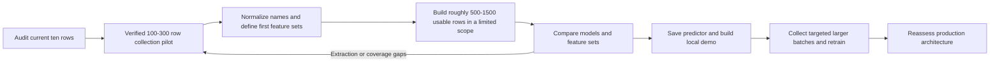

# Data collection, modeling, and local demo plan

Prepared on 1 October 2026. This is the active first-stage plan. Complete this pilot before starting the infrastructure work in [the production plan](PRODUCTION_IMPLEMENTATION_PLAN.md). The [handbook](../reference/PakWheels_Vehicle_Price_Predictor_Handbook.md) remains useful project context.

Workspace update: the implemented first-step layout and runnable audit command are documented in [the root README](../../README.md). The directory tree later in this plan remains a sketch for upcoming pilot work.

Baseline confirmation: the user has confirmed the ten original records are accurate. Accept that confirmation and proceed to identity/schema decisions. The source-audit instructions below still apply to new fields and future batches; repeating the ten-record accuracy check is not required.

Implementation update, 1 October 2026: schema version 2 is implemented and checked against a separate ten-page validation sample. [Source mapping and results](../collection-field-mapping.md) record the field definitions and limitations. All ten dates were `Last Updated`; nine registration years were explicitly stated, all with unknown meaning. Source identity extraction is implemented; canonical catalogue review remains pending. The scraper now supports `--output-dir`, `--refresh`, and `--start-page`. Prepare family sampling and general batch accounting before the varied 100-300-record collection pilot.

## 1. What we are trying to establish

Use the working scraper to build a trustworthy small dataset, determine which inputs can be collected reliably, compare suitable regression algorithms, and demonstrate predictions locally. Increase the dataset after the full path works and measured errors tell us what to collect next.

The first deliverable is a reproducible experiment and a usable local demo. FastAPI, PostgreSQL, Docker, hosted storage, and deployment are later decisions. The previously recommended production stack is a future option to reassess using the pilot's actual needs.

The pilot must answer these questions:

1. Are the recorded prices and vehicle attributes correct?
2. Which makes, models, variants, years, and cities have enough coverage for a first demo?
3. Which attributes are worth collecting and asking the user to enter?
4. Which cleaning rules fix errors without discarding legitimate vehicles?
5. Which model and preprocessing combination improves on a simple comparable-price baseline?
6. What fails on unseen vehicles, rare variants, and new observations?
7. Does additional data improve those failures, or is an extraction/feature problem responsible?

We should finalize a version of the data and model contract through this process. We cannot confidently finalize an algorithm before evaluating data. Early choices are hypotheses; reviewed experiment results turn them into versioned decisions.

## 2. Recommended sequence



These sizes are collection budgets, not statistical guarantees. Count unique usable vehicle groups, not requests or duplicate advertisements. A smaller coherent dataset can be more useful than thousands of unrelated vehicles with one or two examples each.

Begin with cars because their collector works. Validate the six-family motorcycle parser after the car experiment path is established. Cars and motorcycles have separate targets, preprocessing configurations, models, and evaluation reports, even when they share utility code.

## 3. Preserve what works and add only what the pilot needs

Keep the existing scraper's fetching, URL discovery, price conversion, parsing, debug output, and CSV export logic. Preserve an original copy before changes and add focused checks when changing behavior that could corrupt data.

The first changes should solve observed collection problems:

| Need | Minimal change | Why it matters now |
|---|---|---|
| Reach new listings | Add a validated `--start-page` option | Current runs restart at page 1 |
| Sample selected families | Add a controlled way to supply reviewed search URLs or a URL list | Avoid relying entirely on marketplace ordering |
| Keep batches recoverable | Add an output directory or batch prefix | Current CSVs are repeatedly rewritten |
| Know what happened | Write a small JSON run summary and failed-URL list | Counts and failures must be auditable |
| Review extraction | Save permitted representative HTML and raw price text | Parser-complete rows can still be wrong |
| Resume sensibly | Explain selected URLs, attempted fetches, skipped complete rows, and new rows separately | `--ads` currently caps selected URLs, not newly added data |

Implement these incrementally. Do not replace the script with a broad ingestion framework before the dataset audit.

The scraper skips complete saved rows by default and re-fetches selected rows with `--refresh`. Use a separate `--output-dir` for each batch and preserve snapshots before refreshing. The current raw CSV is not a price-history database.

Keep one collector running at a time. Retain the five-second delay and existing access-stop behavior. Add verified HTTP-200 challenge recognition when representative responses are available. Ordinary transient errors can have a small bounded retry policy; access restrictions stop the run.

No live crawl is performed merely by preparing this plan.

## 4. Audit the current sample first

The current clean CSV has ten parser-complete records. It contains several makes, imported vehicles, electric cars, and substantial variant wording. This verifies that a collection path exists. It does not demonstrate broad prediction coverage.

Audit all ten rows before increasing volume:

- Verify that the price is the main listing asking price, expressed as full PKR.
- Check title, model year, mileage, fuel, transmission, engine displacement, city, listing ID, and URL against available source evidence.
- Identify which fields came from the title, URL, labelled specifications, or broad text matching.
- Preserve missing engine displacement for EVs as non-applicable where verified.
- Separate make/model/variant without removing meaningful trim information.
- Check duplicate IDs and titles. Similar titles alone do not mean the same vehicle.
- Record unavailable source evidence and uncertainties rather than treating missing evidence as verified correctness.

Deliverables:

1. Private backups of both CSVs and their checksums.
2. `reports/pilot/initial_audit.md` with each row's review outcome.
3. `reports/pilot/identity_review.csv` with original title, proposed identity, status, and questions.
4. A short list of demonstrated parser mistakes and proposed corrections, if any.

Gate: do not begin a larger crawl while a known systematic price, year, or mileage error remains unresolved.

## 5. Choose a limited first modeling scope

The first demo should support a coherent subset of the market. Determine that subset from the verified pilot rather than claiming support for every collected make.

Start with these hypotheses:

- Two to four common car families with accessible, usable listings.
- A year window based on observed coverage, provisionally 2010-2026, expanded only where evidence exists.
- A few cities with sufficient observations, provisionally Lahore, Karachi, Islamabad, and Rawalpindi.
- Reviewed variants and an explicit unspecified category where the data supports it.

Toyota Corolla, Honda City/Civic, and Suzuki Alto are possible families to investigate, not confirmed coverage commitments. Choose the actual families after checking permitted source results and normalization quality.

Keep valid off-scope observations in raw storage. If the pilot lacks evidence for EVs, unusual imports, or a rare variant, exclude those identities from demo support with a recorded reason. Their presence in the raw dataset is useful for future work.

Deliverable: `configs/pilot_scope.json` listing supported candidates, inclusion rules, selected cities/year range, and reasons. Record changes between experiment versions.

## 6. Collect broadly enough to decide, then collect deeply enough to learn

### A. Extraction and field pilot: 100-300 records

Use a mix of general discovery and reviewed filtered searches. Include different families, years, cities, transmissions, price formats, and missing-field cases. This batch investigates the source; it should not be optimized for a strong model score.

Manually inspect the first 50 usable records where available. Thereafter review a random sample from every batch plus all flagged cases. A provisional 10% random review is a starting workload estimate, not proof of a low error rate. Log actual discrepancies and increase review when errors appear.

Track extraction success and missingness by family, city, and year. Include incomplete rows in those statistics. If one family systematically lacks mileage or a feature, that affects both the training population and the eventual form.

### B. Modeling pilot: roughly 500-1,500 usable records

After the first parser and schema corrections, collect more deeply within the chosen two to four families. Aim for meaningful year, variant, mileage, and city coverage, not equal quotas in every combination.

Do not wait for an arbitrary 1,500-row target to run the first benchmark. Once several hundred coherent rows exist, exercise the training pipeline and inspect provisional validation results. Continue until the demo has a defensible declared scope or narrow it further.

Log requested strata and actual outcomes. If a variant has few advertisements, report the gap instead of inventing rows or merging a materially different variant.

### C. Larger training batches: after the demo

Increase toward 3,000-5,000 cars, then larger sizes if measured improvement warrants it. Prioritize the families and input combinations causing errors. Recheck features and algorithm behavior on the larger dataset; the small-data winner is a provisional choice.

For each batch preserve raw CSV, parser-complete CSV, collection dates, parameters, code/parser version, counts, failed URLs, and a checksum. Training uses a consolidated, explicitly deduplicated dataset rather than simply concatenating every export.

At a five-second delay, 1,000 detail requests alone take at least 83 minutes, before searches and response time. Use resumable batches that fit the available work session.

## 7. Decide what to collect before bulk collection

Collect a stable core plus candidate fields during the extraction pilot. Keeping source evidence for useful optional attributes avoids recollecting everything when an experiment identifies a missing input.

| Field | Collection policy | First model role |
|---|---|---|
| Listing ID, source URL, collection time | Always retain | Traceability and splits; excluded from features |
| Original title | Always retain | Identity review; excluded from initial structured model |
| Make/model/variant | Prefer verified structured fields; normalize conservatively from title otherwise | Candidate categorical inputs |
| Model year | Required; retain extraction source | Core numerical input |
| Asking price in PKR and original price text | Required; verify source/unit | Target and QA; never input features |
| Mileage in kilometres | Preserve null and zero distinctly | Core input for first schema unless the pilot justifies a different missingness policy |
| Listing city | Normalize source/URL evidence | Candidate categorical input |
| Fuel and transmission | Collect when reliably available | Test as additional features |
| Engine displacement | Collect where applicable; retain provenance | Test as an additional feature |
| Assembly and body type | Collect from verified source fields; preserve unknown values | Include in feature comparisons |
| Registration year | Collect only when explicitly stated; record its source and meaning | Optional feature experiment; do not replace model year |
| Listing date and its meaning | Collect the displayed date; distinguish posted, updated, or unknown | Freshness and temporal evaluation; not a required prediction input |
| Registration location and colour | Excluded by the user's scope decision | No pilot input role |
| Parse status, missing fields, quality flags | Always retain | Diagnostics and filtering; excluded from model inputs |
| Seller contacts and unrelated personal data | Do not add to normal data schema | No modeling role |

Do not equate manufacturing year, registration year, posting date, and collection date. Resolve what the labelled year means in representative listings.

Subjective seller claims such as 'excellent condition' or 'perfect condition' are excluded from condition modeling. Condition remains an acknowledged omitted variable in the current scope.

The agreed collection additions and missing-value rules are recorded in [the collection schema](../../configs/collection_schema.json). This decision contract precedes scraper implementation. Listing city remains distinct from excluded registration location.

Before bulk collection, produce `reports/pilot/field_decisions.md` with completeness, reliability, customer input feasibility, and collect/use/defer decisions for each candidate field.

## 8. Preprocessing is two kinds of work

### Source and identity preparation

These operations are deterministic and audited:

- Normalize whitespace, source units, category spellings, and city aliases.
- Resolve make/model/variant using a reviewed catalogue.
- Preserve original text and leftover variant wording.
- Deduplicate exact listing identities.
- Flag suspected repost groups using available non-sensitive evidence.
- Validate numerical values and record exclusions or unresolved issues.

Do not infer engine displacement from model-name digits without a reviewed catalogue rule. Do not collapse Grande, GLi, Oriel, Dream, SE, or G into a generic trim merely to reduce categories.

### Fitted model preprocessing

These operations learn from training data only:

- Missing-value imputation where used.
- Categorical encoding and unknown-category handling.
- Scaling for algorithms that need it.
- Rare-category grouping where justified.
- Target transformations and any fitted correction used to invert them.
- Baseline price-group medians.

Within cross-validation, fit these separately inside each training fold. For sklearn models use a `Pipeline` and `ColumnTransformer` to keep fitted preprocessing with the estimator. CatBoost uses its declared categorical representation and numerical missing-value policy, saved with its model configuration. [scikit-learn composite estimators](https://scikit-learn.org/stable/modules/compose.html), [CatBoost categorical features](https://catboost.ai/docs/en/features/categorical-features).

Raw files stay recoverable. Processed data is written to a separate directory. Every dropped or flagged row has a reason. Do not manually edit the only raw file.

## 9. Compare feature sets deliberately

Begin with a small experiment matrix:

| Set | Inputs | Question |
|---|---|---|
| F0 | Make, model, year, mileage, city | Can a simple available schema produce useful estimates? |
| F1 | F0 plus reviewed variant | Does trim identity explain important price differences? |
| F2 | F1 plus fuel, transmission, applicable engine displacement, assembly, and body type | Do these attributes add value beyond family and variant? |
| F3, only if warranted | F2 plus explicitly sourced registration year or a valid registration-year gap | Does registration timing add useful information after model year and assembly? |

Variant remains preserved even in F0. If dropping it causes large within-family errors, that is evidence against releasing F0, not permission to erase variants from the raw dataset.

Use the same evaluation groups for comparisons. If F2 needs fewer rows because its fields are missing, first compare F1 and F2 on the same eligible population. Report the coverage loss separately. Otherwise an apparent improvement might only reflect easier rows.

Use model year directly first. Test age or mileage transformations only as named experiments with a fixed reference date and shared inference logic. Do not accidentally change the meaning of age when loading a saved model later.

For the strongest candidate, remove one feature group at a time and check validation effects. Permutation importance can help inspect useful inputs, but correlated features and a small sample can make importance unstable. It does not establish causation. [scikit-learn permutation importance](https://scikit-learn.org/stable/modules/permutation_importance.html).

Never feed price-derived values, listing IDs, arbitrary numeric category IDs, or URLs into the predictor. An unknown variant must not silently become a different known trim.

## 10. Evaluation before algorithm selection

### Dataset grouping and holdout

Deduplicate exact listing IDs. Put suspected reposts and repeated observations of the same vehicle in one group. Matching make/model/year/mileage alone is insufficient proof of duplication.

For the small modeling pilot, reserve roughly 20% of independent groups as an untouched demo test set. Use the remaining 80% for development, with three group-aware folds when the available groups make that meaningful. Every candidate uses the same split IDs.

If there are too few groups to support this, keep the experiment exploratory and use a simpler grouped development split. Report the limitation; do not manufacture a reliable score by training and evaluating on the same rows.

Use cross-validation to choose features, algorithms, and small tuning changes. The final test stays closed until the demo candidate is frozen. Rare-family fold counts must be reported. Once multiple collection dates exist, add a genuinely newer group holdout to assess market freshness.

Each test set has an ID and status. If its outcomes influence another tuning decision, it becomes development evidence and is no longer advertised as untouched. A new independent holdout is needed for the next final claim. [scikit-learn evaluation guidance](https://scikit-learn.org/stable/modules/cross_validation.html).

### Metrics and error inspection

Report MAE and median absolute error in PKR, median absolute percentage error, and family/variant/year/city errors with counts. Use RMSE as an optional way to inspect large misses. Compare errors at different price bands because a single aggregate can hide weak estimates on affordable cars.

Review the largest validation misses against source evidence, then classify them:

- Wrong extraction or units.
- Wrong or ambiguous variant identity.
- Insufficient family/year/mileage coverage.
- Missing important attributes.
- Stale or unusual asking price.
- Legitimate unexplained variation.

Each category has a different fix. More data does not repair a consistently wrong price parser.

## 11. Algorithm comparison

Use regression algorithms and compare complete preprocessing/model combinations.

| Candidate | Purpose | Preparation |
|---|---|---|
| Training-only comparable median | Establish whether ML improves on simple comparable prices | Family/year groups with documented fallbacks |
| Ridge regression | Cheap interpretable linear benchmark | Proper categorical encoding, numerical preprocessing, optional tested log target |
| Random Forest regressor | Examine nonlinear relationships with a familiar tabular model | Encoded categories and consistent missing handling |
| CatBoost regressor | Evaluate a categorical-aware boosting approach | Explicit categorical strings, preserved feature contract, controlled training configuration |

The Random Forest is a benchmark rather than a promised winner. CatBoost's categorical handling makes it worth testing, but the result must come from this dataset. [Random Forest reference](https://scikit-learn.org/stable/modules/generated/sklearn.ensemble.RandomForestRegressor.html), [CatBoost categorical documentation](https://catboost.ai/docs/en/features/categorical-features).

Run simple configurations first. Compare raw-PKR and log-price targets only as explicit experiments; report all errors after conversion to PKR. An inverse log transform has its own bias and does not automatically minimize PKR MAE.

Avoid neural networks and a large XGBoost/LightGBM/tuning comparison at this stage unless the first results expose a concrete reason. Four candidates already test simple comparable pricing, linear relationships, bagged trees, and boosting.

Keep an experiment ledger with dataset checksum, split ID, features, preprocessing, algorithm, parameters, seed, training duration, fold metrics, and conclusions. Limit initial tuning to a small named set of trials. Repeating trials until one lucky split looks good is not model selection.

### Choose a demo candidate

Prefer the simplest candidate whose improvement is consistent enough across development folds and useful for the supported families. Examine error spread, coverage, and inference cost as well as average MAE.

A nominal 1% improvement that varies substantially across folds should not force a more complex model. If no algorithm improves meaningfully on the comparable baseline, investigate scope, labels, and features before adding more algorithm families.

Record the chosen candidate, alternatives, measured tradeoffs, and open problems in `reports/pilot/model_selection.md`. Define acceptable absolute or percentage error from validation evidence before opening the final demo test. There is no defensible universal '90% accuracy' target for this regression task.

## 12. Keep the code modular without building infrastructure

The pilot needs a few reusable Python modules and thin scripts. It does not need a framework-driven application skeleton.

```text
scraper.py                         # Working collector, changed only as needed
pilot/
  __init__.py
  identity.py                     # Reviewed name and category resolution
  quality.py                      # Numerical checks and eligibility decisions
  features.py                     # Shared input schema and feature construction
  models.py                       # Candidate pipelines and saved predictor loading
  evaluate.py                     # Splits, metrics, subgroup reporting
scripts/
  audit_data.py
  prepare_dataset.py
  compare_models.py
  train_demo.py
  predict.py
demo.py                            # Local UI when the predictor works
configs/
  pilot_scope.json
  experiments.json
catalogues/
  cars.json
  bikes.json                      # Added for the bike pilot
reports/pilot/
data/raw/                         # Private, recoverable batch copies
data/processed/                   # Private, derived datasets and split IDs
models/pilot/                     # Private model, preprocessing, metadata
tests/                            # Focused behavioral checks
```

Grow this structure when a module has real behavior. The existing environment and requirements can remain in use. Record the tested dependency versions; install ML and demo dependencies only when their phase begins.

Use functions for deterministic work, and classes where fitted state or resource ownership makes them useful. A cleaning function should return cleaned rows and a report; a training command should call a model-building function, not embed all logic in a notebook.

Separate extraction, identity resolution, quality filtering, fitted preprocessing, evaluation, and presentation. The demo and training scripts must call the same feature-preparation implementation.

These are the practical SOLID protections for the pilot. Avoid speculative interfaces, generic repositories, inheritance trees, and one-class-per-function designs. Refactor a duplicated behavior when there is evidence that it is shared.

Use notebooks for inspection and plots if useful, but move decisions needed for repeatable preparation or prediction into importable modules. A notebook executed in a particular cell order must not become the only way to reproduce the experiment.

## 13. Local demo and saved predictor

First verify prediction through `scripts/predict.py` with a saved artifact. Then use a small local Streamlit form for interactive demonstration. Streamlit supports Python widgets and local interactive workflows; its UI stays separate from preprocessing and model logic. [Streamlit basic concepts](https://docs.streamlit.io/get-started/fundamentals/main-concepts).

The demo loads a trusted local predictor rather than training on every interaction. Users select only supported identities and enter the same fields used during training. Show the asking-price estimate, PKR, data period, model version, and a short pilot qualification message.

Handle invalid year/mileage, unknown variants, missing required inputs, and poorly supported families clearly. Keep unspecified variant distinct from a verified base trim. A family with a few observations is not automatically demo-supported.

The saved predictor includes:

- The fitted model and fitted preprocessing.
- Exact feature names/order, category conventions, and target transform.
- Catalogue and quality-policy versions.
- Supported identities and observed input ranges.
- Dataset/split IDs, dependency versions, and experiment configuration.
- Development and final demo evaluation results.
- A few known prediction cases for save/load verification.

Use the model format appropriate to the selected candidate. Load only locally produced, trusted artifacts. The full production bundle loader and artifact storage system can wait.

Do not display a made-up confidence interval. Point estimates plus honest pilot error reporting are enough for this stage.

Demo gate: a fresh process can load the predictor, reproduce documented cases, accept valid inputs, and reject unsupported ones without requiring a training notebook or scraping session.

## 14. Scale training after the demo works

The demo establishes that the complete path is correct. It does not prove that its selected algorithm will remain the best at larger scale.

Use the error report to write a targeted collection queue. Prioritize missing variants, thin year/mileage regions, and supported families with unstable errors. Freeze the next dataset version and reevaluate the strongest candidates.

Plot development error against nested training sizes, for example 300, 600, 1,000, 3,000, and 5,000 rows where available. Keep development evaluation groups fixed and separate from the final untouched holdout. Report subgroup behavior as well as aggregate error.

For the larger dataset, use a documented grouped train/validation/test policy, provisionally 70/15/15, or a chronological policy once dates permit. Groups from an earlier opened demo test stay marked as evaluation-used; either keep them out of development or formally retire that test and create a new independent holdout. Do not accidentally recycle inspected test outcomes into a claim of untouched validation.

If additional data stops helping, investigate normalization, omitted attributes, price outliers, and stale observations. More rows are worthwhile when they add useful independent coverage, not merely increase a headline count.

Deliverable: `reports/pilot/scaling_results.md` with learning curves, new subgroup metrics, candidate reevaluation, and a reasoned collect-more/change-features/proceed decision.

## 15. Motorcycle work

After the car preparation/evaluation/prediction modules work, reuse their general behavior for the motorcycle pilot. Keep the bike parser, catalogue, and feature configuration separate.

Validate permitted returned HTML from Honda CD 70, Honda CG 125, Honda CB 150F, Suzuki GS 150, Suzuki GR 150, and Yamaha YBR 125. Preserve Dream, SE, G, and other variants. Verify prices, model years, mileage, registration, and applicable engine attributes before assuming car selectors work.

Begin with 20-50 reviewed records per family where available. Develop a limited bike experiment, then move toward the handbook's roughly 500 usable records per family if coverage justifies it. Do not delay the first car demo while waiting for those quotas.

Train one shared bike model across the supported families, rather than six separate models, unless later evidence establishes a reason to split them. Report equal-family and observed-sample weighted metrics because CD 70/CG 125 volume can obscure weaker estimates for other families.

The car and bike demos can share a local selector when both predictors have passed their own checks.

## 16. Milestones and concrete outputs

| Milestone | Work | Output | Completion condition |
|---|---|---|---|
| M0: audit | Review the current ten rows and preserve evidence | Initial audit, backups, identity questions | Known systematic extraction errors resolved or explicitly block larger collection |
| M1: source pilot | Collect 100-300 varied records and inspect field availability | Batch manifests, field decisions, parser corrections | Reliable core fields and a practical first modeling scope |
| M2: preparation | Normalize, quality-check, group, and split a growing scoped dataset | Processed CSV, catalogue, exclusions, fixed split IDs | Reproducible preparation without raw-data edits |
| M3: comparison | Compare baseline, Ridge, Random Forest, CatBoost and F0-F2 | Experiment ledger, validation metrics, error review | Reasoned candidate and supported demo input schema |
| M4: demo | Save/load predictor, final held-out check, local form | Local demo and documented prediction cases | Same feature rules in training and inference; explicit refusal behavior |
| M5: larger training | Target gaps, collect larger batches, reevaluate models | Learning curves and larger-data metrics | Evidence for actual improvement or a clear remaining data/feature problem |
| M6: production handover | Review pilot findings against future architecture | Revised production decisions and backlog | Hosting/framework/infrastructure choices reflect demonstrated needs |

M2 and M3 can start before the full modeling collection budget is met. The feedback loop is deliberate. Finalize a candidate only after its preparation and validation evidence are stable enough to support the demo's declared scope.

## 17. Decisions, when to make them, and how to record them

| Decision | Resolve during | Required evidence |
|---|---|---|
| What vehicle scope to collect deeply | M1 | Availability and identity/extraction review |
| Which raw attributes to retain | M1 | Completeness, reliability, likely user input feasibility |
| Identity and quality rules | M1-M2 | Source examples, catalogue review, flags/exclusions |
| Required demo inputs | M3 | Feature comparisons plus coverage and form practicality |
| Fitted preprocessing | M3 | Same-fold results and missing/unknown-input behavior |
| Algorithm and modest parameter choices | M3 | Baseline comparison, fold variability, subgroup errors |
| Supported demo identities/ranges | M3-M4 | Training support and validation evidence |
| Whether larger data is helping | M5 | Fixed development holdout and learning curves |
| Web framework and hosting topology | M6 | Actual input contract, inference latency/memory, user workflows |

Every decision records dataset version, experiment ID, reason, and unresolved limitations. Finalize version 1, then change it deliberately if later evidence warrants version 2.

## 18. Small but meaningful verification

During implementation, protect the following behavior:

- Price-unit parsing, main-price selection, zero mileage, optional EV fields, and changed parsing logic.
- Name aliases, variants, ambiguous matches, and city normalization.
- Raw-data preservation, repeatable processed output, and split group isolation.
- Imputation/encoding fitted on training folds only.
- Saved-predictor outputs matching in-memory outputs for representative cases.
- Demo inputs following the trained feature contract and unsupported cases being refused.

Tests and manual evidence should address actual risks. Production deployment testing, a full monitoring stack, migration tooling, and load targets belong to the later phase.

## 19. Handover into production

Move to the production plan once the pilot supplies a working predictor/demo, a documented input schema, reproducible preprocessing, qualified supported scope, evaluation evidence, and a reasoned larger-data result.

Bring these concrete artifacts forward: catalogues, quality rules, preparation modules, saved-predictor metadata, training configurations, split policies, subgroup errors, collection limits, and remaining risks. The production application should reuse their logic behind new adapters.

Reassess FastAPI versus alternatives at that point. If prediction requests remain the central workflow, the earlier FastAPI rationale may still fit. If staff review or account workflows have become central, the framework decision may change. PostgreSQL, hosted jobs, and object storage should address observed durability or deployment needs.

The first implementation action is M0, followed by the smallest collection changes needed for M1. No scraper changes, collection, training, or demo implementation were performed while writing this plan.
